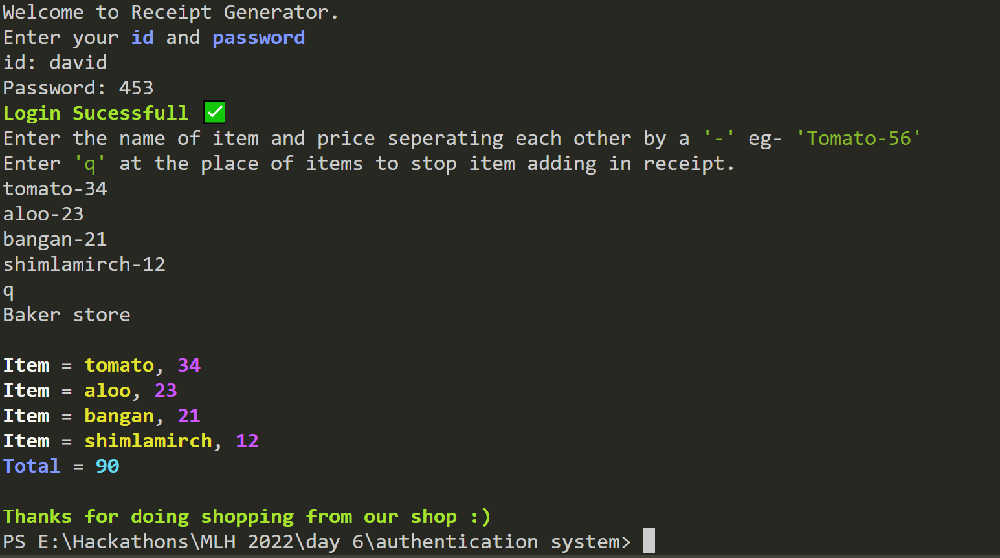
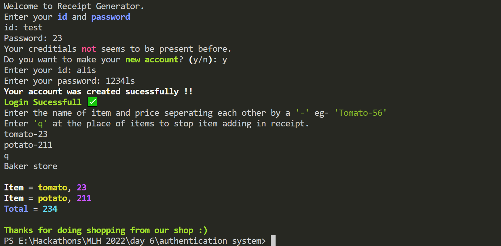

# Receipt generator

This project is a part of This project is a part of [Global Hack Week (GHW)-INIT 2023](https://organize.mlh.io/participants/events/7950-global-hack-week-init-2023).

#### This program is basically a receipt generator which creates a type of bill, this program is made with python. 

### Clone this repository.
```

```

### Library used.
- rich==11.1.0

### Features
- This program also has authentication system for login through your account
- You can also create your account and sign in.
- You have to enter item name and price like this ```potato-34``` program will continously take input from you, for qutting this loop enter ```q``` and press enter, then total will be printed.

### Preview
- Direct login.



- Creating new account.
- Once you created your account you can use it each time when you use this program.

